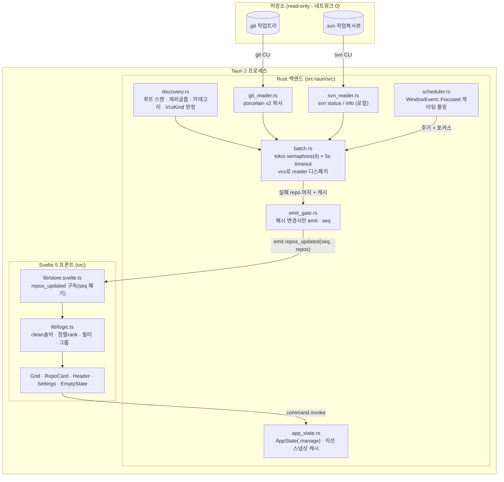
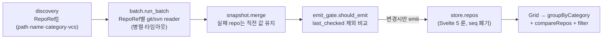

# RepositoryMonitor

> 여러 **git · svn** 저장소의 상태(미커밋·스테이징·브랜치·푸시 여부·워킹트리)를 한 창에서 한눈에 보는 macOS 네이티브 대시보드. SourceTree의 "상태 보기"만 떼어낸 경량판.

[](#설치--빌드)
[](https://tauri.app)
[](LICENSE)

여러 프로젝트를 오가며 `git status`를 일일이 치지 않아도, 등록한 폴더 아래의 모든 저장소가 카드 그리드로 뜨고 **변경이 있는 repo만 붉게 강조**된다. **로컬 전용 — 네트워크를 전혀 타지 않는다.**

---

## 스크린샷

> 준비 중. 카테고리(`2_App` / `4_Server` / `3_Library` …)별로 묶인 카드 그리드 — 각 카드에 브랜치·미커밋 신호·fetched 시각이 표시되고, 깨끗한 repo는 흐리게, 변경이 있는 repo는 붉은 배경으로 강조된다.

---

## 주요 기능

### 📇 멀티 레포 한눈에
- 등록한 **루트 폴더를 스캔**해 그 아래 모든 git/svn 저장소를 자동 발견 (+ 개별 경로 수동 등록, 제외 글롭)
- **카테고리별 그룹** (루트 기준 첫 경로 세그먼트) + 카드 그리드
- **문제 우선 정렬** + `문제만 보기` 필터 + 이름 검색
- 헤더 요약: `N repos · M dirty · K behind · L ahead`

### 🔀 git · svn 동시 추적
- **git**: 브랜치/detached, 로컬 기준 `↑ahead ↓behind`, `+staged ●modified ?untracked ⚠conflict ⚑stash`, merge/rebase 등 진행 상태, 연결 worktree 수, 마지막 fetch 시각
- **svn**: `SVN` 배지 + 브랜치(URL의 trunk/branches/…) + modified/untracked/conflict (svn은 staging·stash·ahead 개념이 없어 미표시)

### 🔒 로컬 전용 (네트워크 0)
- `git status` / `svn status` 등 **read-only 로컬 명령만** 사용 — fetch/pull/push 없음
- git의 `behind`는 *마지막 fetch 시점* 기준이라 카드에 `fetched Nd ago`를 함께 표기(오래되면 흐리게). svn은 out-of-date 확인이 네트워크를 타므로 생략

### 🎨 사용성
- **다크/라이트** — macOS 시스템 외관 자동 추종 + 헤더 토글(system → light → dark)
- **비클린 강조** — 변경이 있는 카드는 붉은 배경 + 좌측 스트라이프, 깨끗한 카드는 흐리게
- **우클릭 메뉴** — Finder / 터미널 / SourceTree 에서 열기 · 경로 복사 · 이 프로젝트 제외
- **포커스 게이팅 폴링** — 창이 활성일 때만 주기(기본 30초) 갱신 + 수동 새로고침(⌘R)

---

## 설치 / 빌드

> 아직 배포 릴리즈가 없어 소스에서 빌드한다. (Prerequisite: [Rust](https://rustup.rs), Node 18+, [pnpm](https://pnpm.io), 그리고 SVN 추적을 쓰려면 `svn` CLI)

```bash
pnpm install        # 의존성 설치 (pnpm-workspace.yaml의 allowBuilds로 esbuild 빌드 허용)
pnpm tauri dev      # 개발 실행 (hot reload)
pnpm tauri build    # 릴리즈 .app/.dmg 빌드
```

자세한 개발·테스트·빌드 절차: [docs/DEVELOPMENT.md](docs/DEVELOPMENT.md)

---

## 사용 방법

1. 앱 실행 → 첫 실행이면 **"스캔할 폴더를 추가하세요"** 화면.
2. `⚙ 설정` → **스캔 루트 추가**(예: `~/Desktop/@Projects`) → 저장하면 그 아래 모든 git/svn 저장소가 스캔되어 카드 그리드로 표시.
3. **카드 읽는 법**:

   | 신호 | 의미 |
   |---|---|
   | `main` / `detached @a1b2c3` | 현재 브랜치 / detached HEAD |
   | `⊘ no upstream` | upstream 없는 브랜치 |
   | `↑2` `↓5` | 로컬 기준 ahead / behind (없으면 숨김) |
   | `+n` `●n` `?n` | staged / modified / untracked 파일 수 |
   | `⚠n` `⚑n` | conflict / stash 수 |
   | `✓ clean` | 깨끗 (흐리게 렌더) |
   | `merging` `rebasing` … | 진행 중 상태 |
   | `+N worktree` | 연결된 추가 worktree 수 |
   | `SVN` | SVN 저장소 |
   | `fetched Nd ago` | 마지막 fetch 시각 (git, behind 신선도) |

4. **우클릭** → Finder/터미널/SourceTree 열기 · 경로 복사 · 이 프로젝트 제외하기. 호버 버튼(`F`/`T`/`S`/`⧉`)으로도 가능.
5. `⚙ 설정`에서 루트/제외 글롭/폴링 주기/스캔 깊이/stale 기준/터미널 앱 조정.

---

## 추적 대상 / 데이터 접근

| VCS | 접근 방식 | 데이터 |
|---|---|---|
| git | `git status --porcelain=v2 --branch` (+ `stash list`, `rev-parse --git-path`, `worktree list`) | 브랜치·ahead/behind·미커밋·stash·state·worktree |
| git | `.git/FETCH_HEAD` mtime | 마지막 fetch 시각 |
| svn | `svn status` · `svn info --show-item relative-url` | 미커밋 변경·브랜치(URL) |

모든 접근은 **read-only 로컬 명령**이며 외부 서버로 데이터를 전송하지 않는다. 신호 → 필드 매핑 상세: [docs/STATUS-MAPPING.md](docs/STATUS-MAPPING.md)

---

## 동작 원리 (아키텍처)

**Tech Stack**: Tauri 2 · Rust (tokio, globset, walkdir, dirs-next) · Svelte 5 · TypeScript · Vite

하나의 Tauri 2 프로세스 안에서 **Rust 백엔드(발견·상태 읽기·집계)** 와 **Svelte 5 프론트(렌더)** 가 IPC로 연결된다. 단일 `main` 윈도우. 데이터는 백엔드 → 프론트 **단방향 push**(`repos_updated` 이벤트), 프론트 → 백엔드는 **command invoke** 뿐.



### 데이터 흐름 (단방향)



1. **발견** — `discovery`가 등록 루트를 walk(깊이 제한·`node_modules`/`.git`/`.svn` 등 prune)하며 `.git`(디렉토리) → git, `.svn` → svn 으로 `RepoRef{path, name, category, vcs}`를 만든다. 제외 글롭은 절대경로에 매칭.
2. **상태 읽기** — `batch.run_batch`가 repo별로 `vcs`에 따라 `git_reader`/`svn_reader`를 tokio 블로킹 태스크로 병렬 실행(동시 상한 8, repo당 5초 타임아웃). git은 `status --porcelain=v2 --branch`를 단일 파싱.
3. **머지/게이트** — 직전 스냅샷을 `AppState`에 캐시해 일시 실패 repo는 이전 수치를 유지(+error). `emit_gate`가 `last_checked`만 다른 무의미 변화는 걸러 **내용이 바뀐 경우에만** `repos_updated{seq, repos}`를 emit.
4. **렌더** — 프론트 `store`가 `listen("repos_updated")`로 구독(오래된 `seq` 폐기)하고, `logic.ts`의 `clean` 술어·정렬 rank·필터·카테고리 그룹으로 그리드를 그린다.

### IPC 경계 (의존 방향)

프론트는 `lib/tauri.ts` 한 곳으로만 백엔드에 의존한다.

| 방향 | 종류 | 시그니처 |
|---|---|---|
| 백→프 | event | `repos_updated` (`{ seq, repos }`, 변경 시만) |
| 프→백 | command | `get_config` · `set_config` |
| 프→백 | command | `scan_repos` · `refresh_status` · `open_action` |

전체 모듈 구조·설계 결정: [docs/ARCHITECTURE.md](docs/ARCHITECTURE.md)

---

## 개발

```bash
pnpm install
pnpm tauri dev
pnpm check          # svelte-check (타입)
pnpm test           # vitest (프론트 로직)
cd src-tauri && cargo test    # Rust 단위/통합 테스트
```

문서: [아키텍처](docs/ARCHITECTURE.md) · [상태 매핑](docs/STATUS-MAPPING.md) · [개발 가이드](docs/DEVELOPMENT.md)

---

## 알려진 한계

- 앱이 실행 중일 때만 갱신된다(백그라운드 데몬 없음).
- git `behind`는 **마지막 fetch 시점** 기준 — 로컬 전용이라 원격을 실시간으로 보지 않는다. svn은 out-of-date(behind)를 표시하지 않는다.
- `clean` 판정에 **stash·worktree>1도 포함**되어, 커밋·푸시가 끝났어도 stash가 남아있으면 카드가 비클린(붉게)으로 표시된다.
- 앱 아이콘은 현재 임시(형제 프로젝트 복제). 메뉴바 트레이/알림/수동 fetch는 미구현(향후).

---

## 라이선스

[MIT](LICENSE)
